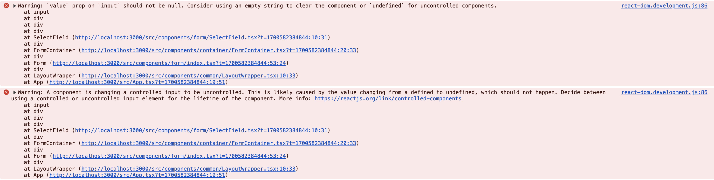

### input



- input 값을 처리하는데 다음과 같은 에러가 났다.
- 문구만 보고, [Controlling an input with a state variable](https://react.dev/reference/react-dom/components/input#controlling-an-input-with-a-state-variable)
  를 읽었을 땐, 제어 컴포넌트라서 onChange를 통해서 input 값을 변경해야하는데, useEffect로 값을 변경한 것 때문에 경고가 뜨는 것이라고 생각했다.
- '방법을 바꿔야하나', 'setState 또는 onChange를 부모로 옮겨야하나' 고민하다가, 간단한 다음과 같은 해결방법이 존재했다.

```TSX
export const SelectField: React.FC<SelectFieldProps> = ({
  label,
  value,
  onChange,
  options,
  customValue,
  onCustomChange,
  disabled,
  error,
}) => {
  const handleSelectChange = (e: React.ChangeEvent<HTMLSelectElement>) => {
    onChange(e.target.value);
  };

  const handleInputChange = (e: React.ChangeEvent<HTMLInputElement>) => {
    onCustomChange(e.target.value);
  };

  return (
    <div className="flex w-full justify-between">
      <div>
        <label className="text-base font-bold">{label}</label>
      </div>
      <div>
        <div className="flex w-[495px] items-center justify-center gap-6">
          <input
            type="text"
            value={customValue || ''}
            // 여기서 value 옆에 || ""를 설정해주니 경고문구가 사라졌다.
            onChange={handleInputChange}
            disabled={disabled}
          />
        </div>
      </div>
    </div>
  );
};
```

- 원인은, controlled 입력 필드가, uncontrolled로 변경되고 있다는 것을 나타내는데, 간단히 말하면 value 속성이 undefined나 null로 설정되었을 때 발생한다고 한다.
- 그래서 값이 없을 때 빈 문자열을 넣어주니 경고문구가 사라졌다.

- 간단한 에러였는데, 너무 복잡하게 생각했던 것 같다.
  - 제어/비제어 컴포넌트와 연관되는 거라고 착각했다.
