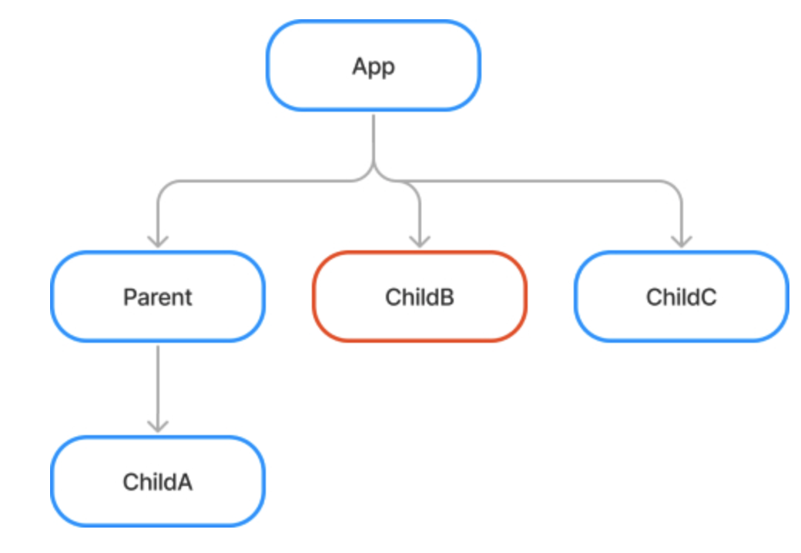
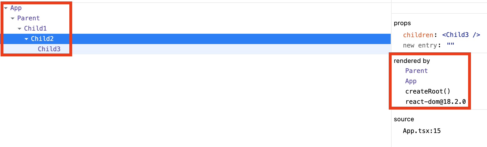
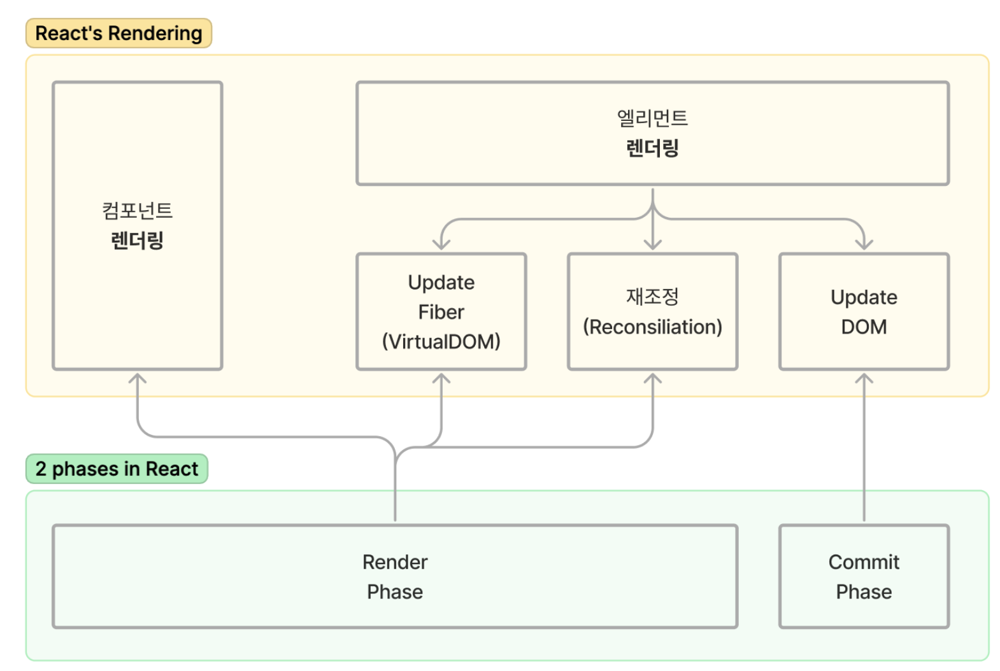

### 리액트 리렌더링 조건

> 3번은 읽은 것 같다. 마지막은 연습장에 글로 써가면서 이해하고, 글에서 묻는 질문에 답을 보지않고 트리를 그려보기도 하면서 알게 된 것을 적어본다.  
> 글이 너무 좋은데, 혹여나 사라질까 노파심에 글을 인용해서 기록용으로 적어보려고 한다  
> 모든 내용은 온전히 [리액트의 리렌더링 조건을 더 쉽게 이해해보기](https://velog.io/@mogulist/understanding-react-rerender-easily) 이 글에서 배운 내용을 인용하였다.

<br />

- 부모 컴포넌트가 리렌더링되면 자식 컴포넌트들도 리렌더링 됨
- 자식 컴포넌트란, 부모 컴포넌트의 JSX 안에서 사용된 모든 컴포넌트들
  - "JSX안에서 사용된 컴포넌트"란 \<Components /> 형태로 사용된 컴포넌트
  - props, children으로 받은 컴포넌트는 자식 컴포넌트가 아님
- 자식 컴포넌트들끼리는 형제임
  - 형제 관계인 컴포넌트들끼리 서로 리렌더링에 영향을 미치지 않음

<br />

```JSX
function App() {
  return (
    <Parent lastChild={<ChildC />}>
      <ChildB />
    </Parent>
  );
}

function Parent({ children, lastChild }) {
  return (
    <div className="parent">
      <ChildA />
      {children}
      {lastChild}
    </div>
  );
}
```

- 위 코드의 트리구조는 다음과 같음



<br />

### 컴포넌트 트리와 렌더링 관계 트리

- 컴포넌트 트리는 렌더링 관계가 아닌 중첩된 DOM 트리 구조를 보여주는 것(즉, 부모자식의 렌더링 관계와는 무관함)
- 렌더링 관계 트리를 확인하기 위해선 React Dev Tools를 통해 rendered by를 확인하여 리렌더링할 수 있는 컴포넌트를 확인해야함


DOM 트리나, 컴포넌트 트리를 보고 리렌더링 관계를 판단하면 틀릴 수 있다.

<br />

### 2가지 렌더링과 2가지 단계(phase)

- 리액트로 웹개발을 할 때에 `리액트의 렌더링`과, `브라우저의 렌더링` 두 가지로 나누어 볼 수 있음.
- 여기서는 리액트의 렌더링에 대해서만 다루었음.


리액트의 렌더링

<br />

- `컴포넌트 렌더링`: 컴포넌트를 실행하여 리액트 엘리먼트를 리턴하는 것
- `엘리먼트 렌더링`: 엘리먼트를 DOM에 반영하는 것. 이 과정에서 fiber를 구성 및 업데이트하고, 재조정 과정을 거쳐 변경된 부분만 DOM을 업데이트함.
- 그리고 다시 리액트에는 `렌더 단계 + 커밋 단계`의 두 단계가 있음

<br />

- **컴포넌트 렌더링/엘리먼트 렌더링과 렌더단계/커밋단계는 서로 일치하지 않음(그림참고)**
- `render단계`: 컴포넌트 렌더링부터 엘리먼트 렌더링의 재조정까지, 즉 이전 렌더링과 비교하여 변경된 부분을 파악까지만 함
- `commit단계`: DOM을 업데이트한다. 단, 변경된 부분만
- commit단계에서 DOM을 업데이트한 후 라이프사이클 메소드와 useEffect가 실행됨

<br />

### 참고자료

[리액트의 리렌더링 조건을 더 쉽게 이해해보기](https://velog.io/@mogulist/understanding-react-rerender-easily)
