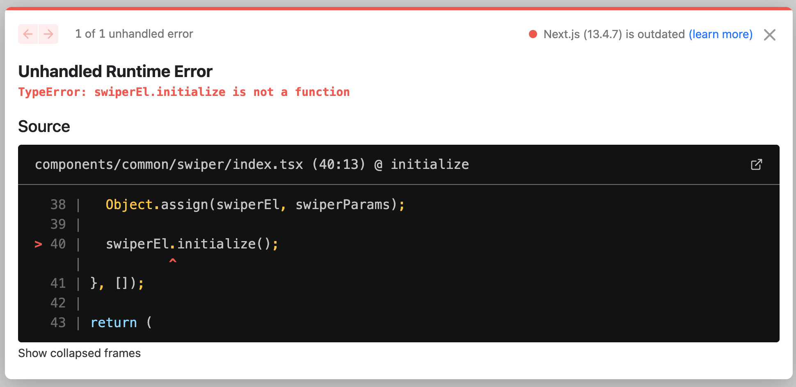

### Swiper

> Swiper를 가장 처음 사용했을 땐, [Swiper React Components](https://swiperjs.com/react)를 사용해서 개발했었다.
> Swiper와 SwiperSlide를 불러와서 적용한 후, Slide의 개수에 맞게 적용하면 되었기에 간단하고 편했다.
> 하지만 이젠 Swiper React Components를 사용하려 하면, 공식문서에 다음과 같은 문구를 보게 된다.

`Swiper React components will likely to be removed in future versions. It is recommended to migrate to Swiper Element instead.`

즉, 향후 버전에선 Swiper React Components가 제거될 가능성이 높다고 한다.
그래서 공식문서에서는 Swiper Element를 사용하라고 권장하고 있다.

### Swiper Element

Swiper Element는 Web Component를 기반으로 만들어 졌다.
간단한 사용 방법은, [공식문서](https://swiperjs.com/element)에서도 잘 소개되어 있다.
나는 이걸 다음과 같이 적용하여 사용하려 했다.

```TSX
// components/common/swiper
import { Children, useEffect, useRef } from 'react';
import { SwiperContainer } from 'swiper/element';
import { register } from 'swiper/element/bundle';
import { ArrowRightCircle, ArrowLeftCircle } from 'lucide-react';

type SwiperWrapperProps = {
  children: React.ReactNode;
  className?: string;
};

export const SwiperWrapper: React.FC<SwiperWrapperProps> = ({ children }) => {
  return (
    <>
      <SwiperContainerComp>{children}</SwiperContainerComp>
    </>
  );
};

type SwiperContainerProps = {
  children: React.ReactNode;
  //   swiperOptions: any;
};

export const SwiperContainerComp: React.FC<SwiperContainerProps> = ({
  children,
  //   ...swiperOptions
}) => {
  const swiperRef = useRef<SwiperContainer>(null);

  useEffect(() => {
    register();

    if (!swiperRef.current) return;
    const swiperEl = swiperRef.current;

    const swiperParams = {};

    Object.assign(swiperEl, swiperParams);

    swiperEl.initialize();
  }, []);

  return (
    <section className="h-full">
      <swiper-container
        style={{
          width: '100%',
          height: '100%',
        }}
        ref={swiperRef}
        init={false}
      >
        {Children.map(children, (child) => (
          <swiper-slide
            style={{
              width: '100%',
              height: '100%',
              display: 'flex',
              alignItems: 'center',
              justifyContent: 'center',
            }}
          >
            {child}
          </swiper-slide>
        ))}
      </swiper-container>
      <ArrowLeftCircle
        className="swiper-button swiper-button-prev"
        onClick={() => swiperRef.current?.swiper.slidePrev()}
      />
      <ArrowRightCircle
        className="swiper-button swiper-button-next"
        onClick={() => swiperRef.current?.swiper.slideNext()}
      />
    </section>
  );
};

```

- 해당 swiper-container와 swiper-slide는 Swiper Element에서 제공하는 Web Component이다.
- 스타일을 inline으로 적용한 이유는, 공식문서에서 제공하는 [Injecting Styles](https://swiperjs.com/element#injecting-styles)가 제대로 동작하지 않았기 때문이다.
- 원래 useEffect내에, swiperParams를 적용하고, 그 내부에 style를 적용했으나, 적용되는 것도 있는 반면, 적용되지 않는 사례도 있었다.
- 그래서 결국, inline으로 적용하게 되었다.

<br />

### register는 useEffect 내부에 사용하자

- next.js app dir을 사용하면, register를 사용할 때, 어차피 한 번만 선언하면 되는 것이니, layout.tsx에 옮기면 되겠다고 판단했었다.
- 하지만 register를 layout.tsx에 적용하니 다음과 같은 에러가 발생했다.



- 즉 SwiperEl에서 initialize를 호출할 때, SwiperEl이 존재하지 않는다는 에러였다.
- 공식문서에 내용을 찾아보니, 메인테이너의 [답변](https://github.com/nolimits4web/swiper/issues/6839)을 확인할 수 있었다. 간단히, register를 적용하면 된다는 의미였다.

<br />

### Swiper Element에서 Typescript 적용하기

- 맨 처음 swiper-container나, swiper-slide를 사용하면, 타입에러가 발생한다.
- 이것 또한, github issue에서 확인할 수 있었다.
- 결론부터 말하자면, swiper.d.ts를 이용해 global로 타입을 적용해주었다

[여기 나온 global 타입 선언을 참고했다.](https://github.com/nolimits4web/swiper/issues/6466#issuecomment-1464979762)

<br />

### 사용방법

```TSX
    <SwiperWrapper>
    {letters.data.map((letter, key) => (
        <Letter key={key} {...letter} />
    ))}
    </SwiperWrapper>
```

<br />

### 참고자료

[Usage with React](https://swiperjs.com/element#usage-with-react)
