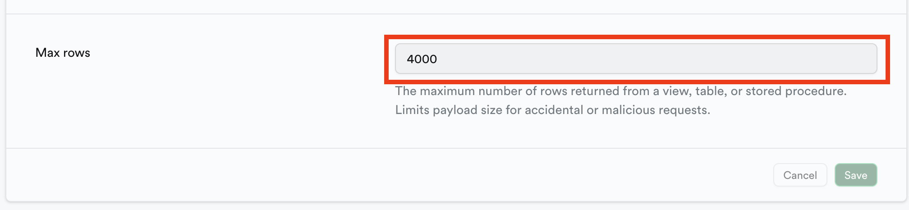

### int와 numeric float의 차이가 뭘까?

- supabase를 사용하면서 다양한 데이터 타입을 접하게 된다.
- MySQL정도 써봤을 때, 이 또한 prisma를 사용했기에 해당 타입은 아직 생소하다.
- 위 `int`, `numberic`, `float` 모두, Number type 같은데, 뭐가 다른걸까?

1. Numeric(숫자형)

- 정확한 숫자, 소수점이 있는 숫자를 저장하는데 사용 됨
- Numeric(5,2)는 5자리 숫자 중에서 소수점 2자리까지 저장 가능

 

2. Integer

- 오직 정수만 저장할 수 있으며, 크지 않은 정수를 처리하는데 사용 됨
- supabase에서는 int4, int8 이런식으로 사용되는데, 모두 integer과 동일함
  단, 저장할 수 있는 Byte가 다름
- int, int4는 4byte, int8은 8byte를 저장할 수 있음
- int2는 2byte를 저장할 수 있음

 

3. Float

- Float는 근사치를 저장하는데 사용되는 데이터 타입
- 정확도보단, 저장 공간 효율성이 더 중요한 경우 적합
  - 과학적 계산, 그래픽 처리 등

 

### supabase에서 3800개가 넘는 데이터를 불러와야하지만 1000개만 불러옴.

- dashboard → settings → API로 들어온 뒤 Max rows를 1000에서 4000으로 늘려주었다

- 이렇게 하면 해당 데이터는 총 4000개까지 불러올 수 있다.
- 현재 진행하고 있는 프로젝트의 데이터는 최대 한 번에 불러와야하는게 3000개 정도 된다.
- 이를 위해 제한을 풀어주었다.
- 하지만, 데이터를 한 번에 불러와서 뿌려주다보니, 너무 느리다. DOM에서 3000개의 마커를 그려야하는데, 당연히 느릴 것이다.
- 그래서 해당 데이터를 보고 있는 유저의 Viewport 기반으로 데이터를 불러와야하나 고민하는 중이다.

[Max rows in API Settings doesn't working #4544](https://github.com/supabase/supabase/issues/4544)
