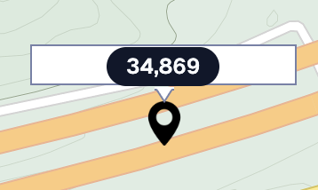

### react-kakao-maps-sdk

- Marker를 추가하고 CustonOverlay를 통해 교통량 수치를 표시해주고 싶었다.

```TSX
'use client';


export const MapContainer: React.FC<MapContainerProps> = ({ data }) => {
  const [zoomLevel, setZoomLevel] = useState(3);
  const markerRef = useRef(null);

  return (
    <>
      {/* eslint-disable-next-line @next/next/no-before-interactive-script-outside-document */}
      <Script
        src={`//dapi.kakao.com/v2/maps/sdk.js?appkey=${process.env.NEXT_PUBLIC_MAP_API_KEY}&libraries=services,clusterer&autoload=false`}
        strategy="beforeInteractive"
      />
      <Map
        center={{ lat: LOCATION.LATITUDE, lng: LOCATION.LONGITUDE }}
        style={{ width: '100%', height: '100vh' }}
        level={3}
        onZoomChanged={(map) => setZoomLevel(map.getLevel())}
      >
        {zoomLevel < 10 &&
          data.slice(0, 100).map((item, index) => {
            if (item.XCODE && item.YCODE) {
              return (
                <>
                  <MapMarker
                    key={index}
                    position={{
                      lat: item.XCODE as number,
                      lng: item.YCODE as number,
                    }}
                    image={{
                      src:
                        item.source === 'highway'
                          ? '/images/h-marker.png'
                          : item.source === 'seoul'
                            ? '/images/s-marker.png'
                            : '/images/i-marker.png',
                      size: {
                        width: 25,
                        height: 25,
                      },
                    }}
                  >
                    <CustomOverlayMap
                      ref={markerRef}
                      position={{
                        lat: item.XCODE as number,
                        lng: item.YCODE as number,
                      }}
                      xAnchor={0.5}
                      yAnchor={2.3}
                    >
                      <Badge>{formatNumberWithCommas(item['2022_aadt'])}</Badge>
                    </CustomOverlayMap>
                  </MapMarker>
                </>
              );
            }
            return null;
          })}
      </Map>
    </>
  );
};
```

- 다음과 같이 작성하면, 마커인포윈도우라는게 생겨버리는데, 다음과 같은 이미지가 적용된다.



- 여기서 수치를 표현하는 Badge에 Div element가 하나 추가되는데, 이를 제거하고 싶었다.
- 하지만 element를 찾아봐도, 해당부분의 key값으로 제공되는 id나, class가 없었다.
- ref를 이용해서 상위에서 핸들링해보려 했지만, 몇 번의 deps를 3번 이상 내려가야하는 것 같았다.

<br />

- 공식문서나, github issues를 찾아봤을 땐, CustomOverlay를 사용하면 된다고 적혀있었는데, CustomOverlay를 사용하는데, 다른 분들은 어떻게 div의 스타일을 제거한 걸까...?

<br />

- CustomOverlay에 Marker를 추가하면 되지 않을까? 했는데, view level에 따라서 Marker의 위치가 변했다;;
- 교통량 지점은 위도경도에 따라 지정되는데, 이는 변경되면 안된다. 변경될 경우 수요분석에서 정산지점이 변경된다는 것인데, 이것으로 분석가가 정산을 다시해야한다면, 엄청난 손실이다; 정산이 한 두시간만에 끝나는 작업도 아니니 말이다.

<br />

- 결론부터 말하자면, 나는 바보가 따로없다. 라이브러리에서 제공하는 코드에는 정답이 있었음에도, 왜 이런 시도를 하지 않았던 걸까.

```TSX
export const MapContainer: React.FC<MapContainerProps> = ({ data }) => {
  const [zoomLevel, setZoomLevel] = useState(3);
  const markerRef = useRef(null);

  return (
    <>
      {/* eslint-disable-next-line @next/next/no-before-interactive-script-outside-document */}
      <Script
        src={`//dapi.kakao.com/v2/maps/sdk.js?appkey=${process.env.NEXT_PUBLIC_MAP_API_KEY}&libraries=services,clusterer&autoload=false`}
        strategy="beforeInteractive"
      />
      <Map
        center={{ lat: LOCATION.LATITUDE, lng: LOCATION.LONGITUDE }}
        style={{ width: '100%', height: '100vh' }}
        level={3}
        onZoomChanged={(map) => setZoomLevel(map.getLevel())}
      >
        {zoomLevel < 10 &&
          data.slice(0, 100).map((item, index) => {
            if (item.XCODE && item.YCODE) {
              return (
                <>
                  <MapMarker
                    key={index}
                    position={{
                      lat: item.XCODE as number,
                      lng: item.YCODE as number,
                    }}
                    image={{
                      src:
                        item.source === 'highway'
                          ? '/images/h-marker.png'
                          : item.source === 'seoul'
                            ? '/images/s-marker.png'
                            : '/images/i-marker.png',
                      size: {
                        width: 25,
                        height: 25,
                      },
                    }}
                  />
                  <CustomOverlayMap
                    ref={markerRef}
                    position={{
                      lat: item.XCODE as number,
                      lng: item.YCODE as number,
                    }}
                    xAnchor={0.5}
                    yAnchor={2.3}
                  >
                    <Badge>{formatNumberWithCommas(item['2022_aadt'])}</Badge>
                  </CustomOverlayMap>
                </>
              );
            }
            return null;
          })}
      </Map>
    </>
  )
};

```

- 위의 코드 차이점은, MapMarker의 Props로 CustomOverlayMap을 사용했지만, 아래는 형제관계로 두면 된다.
- 그럼 깔끔하게 적용된다;
- 이렇게 간단한 걸로 몇 시간을 날린건지 모르겠다...
